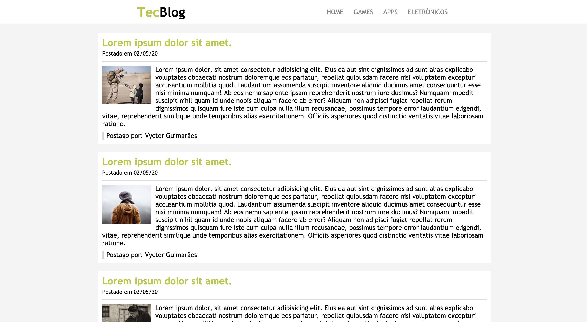

	
 

# TecnoBlog

A simply blog, created using only **HTML** and **CSS**.

## 📝 License

This project is licensed under the MIT License - see the [LICENSE](LICENSE) file for details.

---

Made by Vyctor Guimarães 👋 [See my linkedin](https://www.linkedin.com/in/vyctorguimaraes/)